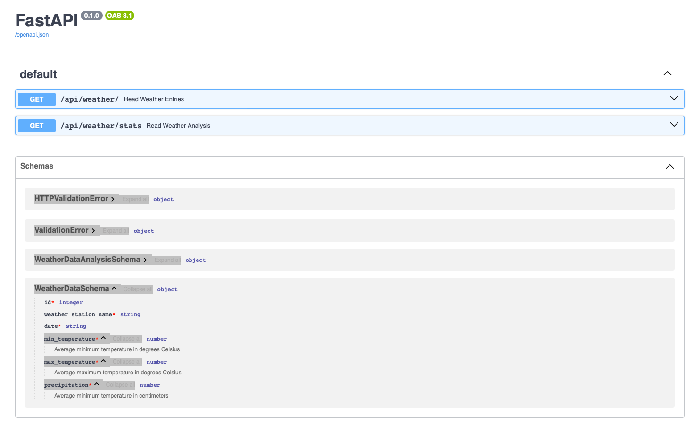

# How to run this project

## Note: See  [architecture.md](architecture.md) for "Design Process and Consideration"

## Step 1: 
Create a virtual environment and install the requirement file: 

Optionally, install conda and create a virtual environment with conda to aid in installation of binary dependencies.

```shell
conda create -n myenv_weather 'python>=3.11,<3.12' psycopg2 pandas
conda activate myenv_weather
```

Install additional pip requirements.
```shell
pip install -r requirements.txt
```

## Step 2: Create and export the environment file

Create an `.env` file:

Example:
```
POSTGRES_SERVER=localhost
POSTGRES_USER=YourUser
POSTGRES_PASSWORD=YourPassword
POSTGRES_DB=YourDB
```

Load the environment
```shell
export $(cat .env)
```

## Step 3: Database migration
Update the database with the latest schema using alembic 
```shell
alembic upgrade head
```

## Step 4: Database Schema
Manually check if the database schema generated three tables:
weather_data, weather_station, weather_data_analysis

## Step 5: Load data from `wx_data`
Load weather_data and weather_station to the database 
```shell
python -m weather_monitor.load
```
Manually check if two tables (weather_data and weather_station) have data present. 

## Step 6: Run analysis and generate aggregates using `data_analysis.py`
Load data_analysis.py it is a SQL script calculate the data from the above two tables:
```shell
python -m weather_monitor.data_analysis
```
After run the script, check the table weather_analysis has data present. 

## Step 7: Unit test
```shell
pytest weather_monitor_tests/test_api.py -s    
```

## Step 8: Run model deployment with the web API
```shell
python -m uvicorn weather_monitor.main:app --reload   
```

## Step 9: Model deployed with the web API
Open browser
http://127.0.0.1:8000/api/weather/

Example
```JSON
[
  {
    "id": 7138494,
    "weather_station_name": "USC00257715",
    "date": "1985-01-01",
    "min_temperature": -14.4,
    "max_temperature": -8.3,
    "precipitation": 0.0
  },
  {
    "id": 7138495,
    "weather_station_name": "USC00257715",
    "date": "1985-01-02",
    "min_temperature": -13.3,
    "max_temperature": 0.0,
    "precipitation": 0.0
  },
  {
    "id": 7138496,
    "weather_station_name": "USC00257715",
    "date": "1985-01-03",
    "min_temperature": -11.1,
    "max_temperature": 2.2,
    "precipitation": 0.0
  },
  {
    "id": 7138497,
    "weather_station_name": "USC00257715",
    "date": "1985-01-04",
    "min_temperature": -5.0,
    "max_temperature": 6.1,
    "precipitation": 0.0
  },
  {
    "id": 7138498,
    "weather_station_name": "USC00257715",
    "date": "1985-01-05",
    "min_temperature": -6.7,
    "max_temperature": 7.8,
    "precipitation": 0.0
  },
  {
    "id": 7138499,
    "weather_station_name": "USC00257715",
    "date": "1985-01-06",
    "min_temperature": -1.1,
    "max_temperature": 9.4,
    "precipitation": 0.0
  },
  {
    "id": 7138500,
    "weather_station_name": "USC00257715",
    "date": "1985-01-07",
    "min_temperature": -1.1,
    "max_temperature": 5.6,
    "precipitation": 0.0
  },
  {
    "id": 7138501,
    "weather_station_name": "USC00257715",
    "date": "1985-01-08",
    "min_temperature": -8.9,
    "max_temperature": 1.7,
    "precipitation": 0.0
  },
  {
    "id": 7138502,
    "weather_station_name": "USC00257715",
    "date": "1985-01-09",
    "min_temperature": -9.4,
    "max_temperature": -5.0,
    "precipitation": 0.0033
  },
  {
    "id": 7138503,
    "weather_station_name": "USC00257715",
    "date": "1985-01-10",
    "min_temperature": -10.6,
    "max_temperature": -6.1,
    "precipitation": 0.0041
  }
]
```
Open browser
http://127.0.0.1:8000/api/weather/stats

Example
```JSON
[
  {
    "id": 24163,
    "year": 1987,
    "weather_station_name": "USC00257515",
    "avg_min_temperature": 5.969078947368423,
    "avg_max_temperature": 19.875657894736836,
    "total_precipitation": 0.6916
  },
  {
    "id": 24164,
    "year": 1994,
    "weather_station_name": "USC00116446",
    "avg_min_temperature": 7.215616438356172,
    "avg_max_temperature": 18.762739726027412,
    "total_precipitation": 0.9811999999999995
  },
  {
    "id": 24165,
    "year": 2011,
    "weather_station_name": "USC00131533",
    "avg_min_temperature": 3.7057534246575354,
    "avg_max_temperature": 16.719178082191775,
    "total_precipitation": 1.0411999999999997
  },
  {
    "id": 24166,
    "year": 2014,
    "weather_station_name": "USC00255310",
    "avg_min_temperature": 1.7052054794520566,
    "avg_max_temperature": 18.51730769230769,
    "total_precipitation": 0.7061000000000002
  },
  {
    "id": 24167,
    "year": 1992,
    "weather_station_name": "USC00116579",
    "avg_min_temperature": 6.9065573770491895,
    "avg_max_temperature": 18.52486338797813,
    "total_precipitation": 0.8697999999999998
  },
  {
    "id": 24168,
    "year": 1986,
    "weather_station_name": "USC00115326",
    "avg_min_temperature": 2.984109589041099,
    "avg_max_temperature": 14.870958904109584,
    "total_precipitation": 0.8598000000000002
  },
  {
    "id": 24169,
    "year": 2001,
    "weather_station_name": "USC00126001",
    "avg_min_temperature": 9.633112582781466,
    "avg_max_temperature": 21.898000000000003,
    "total_precipitation": 0.6819000000000001
  },
  {
    "id": 24170,
    "year": 2008,
    "weather_station_name": "USC00125337",
    "avg_min_temperature": 4.827605633802818,
    "avg_max_temperature": 16.168450704225375,
    "total_precipitation": 1.1364999999999994
  },
  {
    "id": 24171,
    "year": 2011,
    "weather_station_name": "USC00115833",
    "avg_min_temperature": 3.534254143646411,
    "avg_max_temperature": 15.019944598337947,
    "total_precipitation": 1.0121000000000004
  },
  {
    "id": 24172,
    "year": 1997,
    "weather_station_name": "USC00259090",
    "avg_min_temperature": 4.1972375690607775,
    "avg_max_temperature": 15.867217630853983,
    "total_precipitation": 0.7722000000000001
  }
]
```

## Step 9: Swagger Documentation
http://127.0.0.1:8000/docs

Example 


# AWS Deployment

For deploying to AWS, we should use RDS for PostgreSQL to ensure AWS maintains and backs up our database for us.

For deploying the REST-API, we should dockerize our application. We should use the miniconda3 docker image to provide 
the necessary binary dependencies, and we should install our additional dependencies with pip inside the container image.

Our container image should then be pushed to Amazon Elastic Container Registry (ECR). From there, we can create an
Elastic Container Service (ECS) Fargate cluster, and we can deploy our application container to fargate instances. We can then
expose the API using either AWS API Gateway or an AWS Elastic Load Balancer. This can provide a managed SSL certificate
for security.