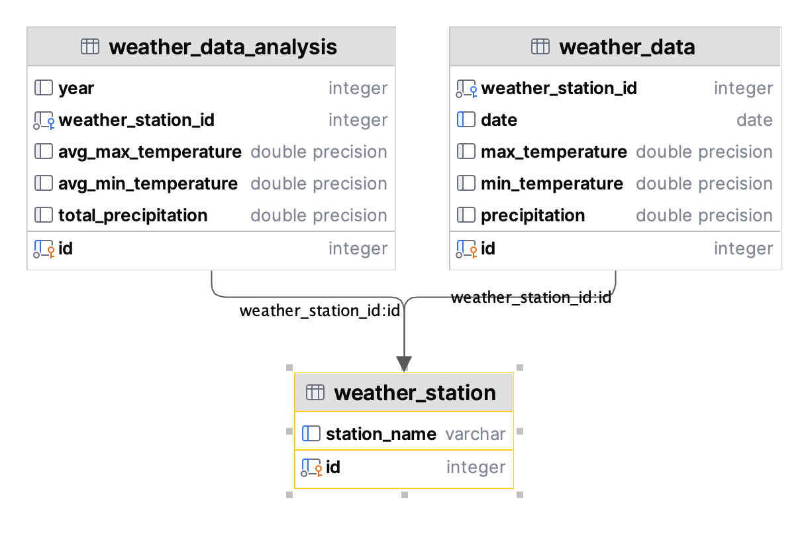

# Design Process and Consideration 

## Technology 
- API
  - Fast-API (Built in Swagger support)
  - Pydantic (Fast-API integration)
- Database
  - SQL Alchemy and alembic
  - RDS for the database with PostgreSQL
- Data Analysis
  - run SQL query to generate statistics from tables. 

## Dev Notes
### Configuration and secrets
- `config.py` for database configuration 
- `.env` for credentials 

### API endpoint
- `api_route.py`: Defines two endpoints for a FastAPI application using an APIRouter
- `database_engine.py`: Provides the configuration for the SQLAlchemy database in a FastAPI application.
- `deps.py`: 
  - Defines a dependency named get_db for obtaining a database session using SQLAlchemy. 
  - Additionally, it creates a type alias SessionDep using the Annotated type for Swagger Documentations. 
- `main.py`: Sets up a FastAPI application and includes a router from `api_route.py`

### Design Database models at `models.py`: 
- weather_data: id(PK), date, weather_station_id, max_temperature, min_temperature, precipitation. 
- weather_station: id(PK), station_name
- weather_analysis: id(PK), year, weather_station_id, avg_max_temperature, avg_min_temperature, total_precipitation. 

### Pydantic Schema 
- Pydantic models for WeatherDataSchema and WeatherDataAnalysisSchema to represent the structure and validation rules.

### Load data script at `load.py`: 
- Load raw data: 
  - function "load_weather_data" load the raw data from each file in wx_data folder
  - function "load_all_weather_files" load the station name which parsed by regex in each file in the wx_data folder 
  - Remove missing value `9999`, `-9999`, `999`
  - Convert unit for temperature from `in tenths of a degree Celsius` to `in degrees Celsius`
  - Convert unit for precipitation from `in tenths of a millimeter` to `in centimeters`

### Aggregated data generated by `data_analysis.py`
- Use SQL query to generate data aggregation and save them into weather_data_analysis table  

### Integration Test `test_api.py`
- For two API endpoints: `api/weather` and `api/weather/stats`
- connection success: 200
- pagination: Response should be paginated to only return 10 elements
- data: First item should be dictionary with expected keys
